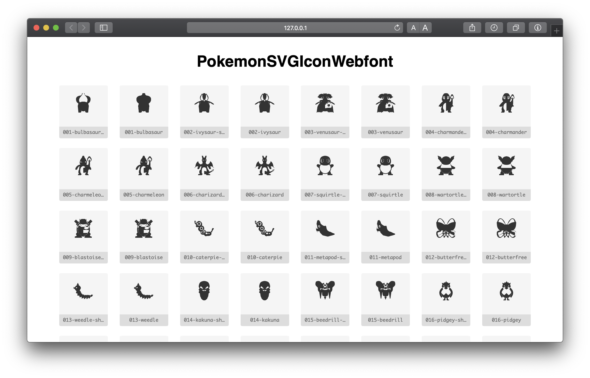

# Pokémon SVG Icon Webfont

Pokémon SVG Icons from: [TheArtificial/pokemon-icons](https://github.com/TheArtificial/pokemon-icons)



### Install

Include Stylesheet in your HTML

```html
<link href="/dist/css/pokemon-iconfont.css" rel="stylesheet" type="text/css" />
```

### Use Icons

Use the css class `pkmn` and additional a class of this scheme: `pkmn-<3 digit pokemon nr.>-<name>(-<form>)`

- `()`: Optionals
- `<>`: Variables

##### Pokemon Icon

Charizard

```html
<i class="pkmn pkmn-006-charizard"></i>
```

##### Pokemon Icon with special form

Shaymin Sky Form

```html
<i class="pkmn pkmn-492-shaymin-sky"></i>
```
